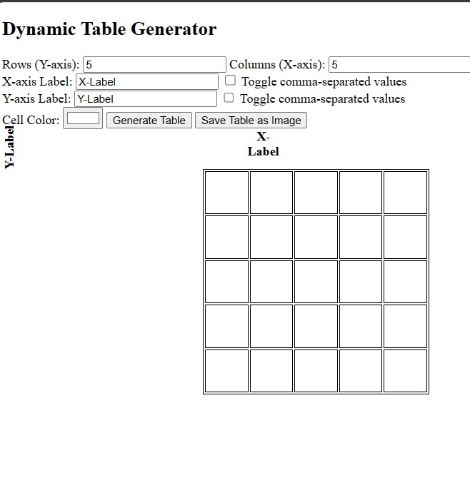

# TableSetter Dynamic Table Generator

This Flask application allows users to dynamically generate a table with editable cells and configurable X and Y axis labels. Additionally, users can save the generated table as an image.

## Features

- Generate a table with a specified number of rows and columns.
- Edit the content of each cell in the table.
- Configure the labels for the X and Y axes, with the option to use comma-separated values for labels.
- Save the generated table as a PNG image.

## How to Run the Application

1. Ensure you have Flask installed. If not, install it using pip:

2. Clone or download the application code to your local machine.

3. Navigate to the application directory and run the Flask application:

python tablesetter.py

## How to run with Gunicorn

## Why Use Gunicorn?

[Gunicorn](https://gunicorn.org/) (Green Unicorn) is a WSGI HTTP server for Python web applications. While Flask's built-in development server is suitable for development purposes, it's not recommended for production use. Gunicorn is a production-ready server that can handle multiple concurrent requests efficiently.

## How to Run the Application with Gunicorn

1. Ensure you have Gunicorn installed. If not, install it using pip: (it's like pip install gunicorn)

2. Clone or download the application code to your server.

3. Navigate to the application directory and run the Flask application with Gunicorn:

gunicorn -w 4 -b 0.0.0.0:8000 tablesetter:app

- `-w 4` specifies the number of worker processes (adjust as needed).
- `-b 0.0.0.0:5000` binds Gunicorn to all IP addresses on port 5000, allowing external access.

4. Access the application through a web browser at `http://your_server_ip:8000`.

